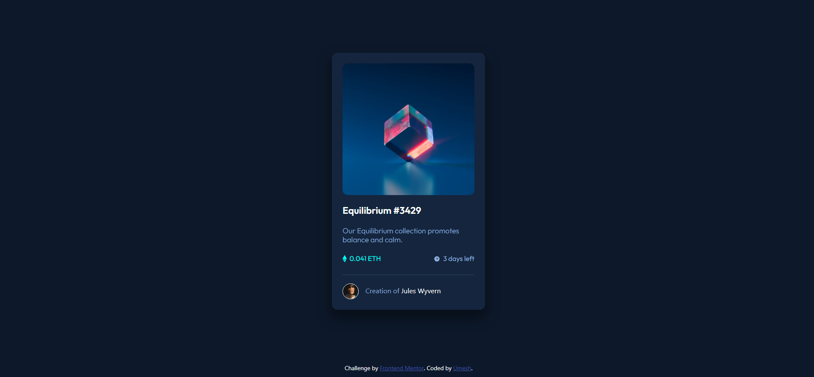

# NFT-Preview-Card-Component

This is a solution to the [NFT preview card component challenge on Frontend Mentor](https://www.frontendmentor.io/challenges/nft-preview-card-component-SbdUL_w0U). Frontend Mentor challenges help you improve your coding skills by building realistic projects. 

## Table of contents

- [Overview](#overview)
  - [The challenge](#the-challenge)
  - [Screenshot](#screenshot)
  - [Links](#links)
- [My process](#my-process)
  - [Built with](#built-with)
  - [What I learned](#what-i-learned)
  - [Useful resources](#useful-resources)
- [Author](#author)

## Overview

### The challenge

Users should be able to:

- View the optimal layout depending on their device's screen size
- See hover states for interactive elements

### Screenshot



### Links

- Live Site URL: [Add live site URL here](https://your-live-site-url.com)

## My process

### Built with

- Semantic HTML5 markup
- CSS custom properties
- [Bootstrap](https://getbootstrap.com/) - Bootstrap Framework

### What I learned

I learned about overlaying images using CSS in this challenge.

```css
.overlay{
  background-color:hsla(178, 100%, 50%, 0.568);
  padding: 0;
  height: 248px;
  width: 248px;
  border-radius: 10px;
  transition: 0.3s ease;
  opacity: 0;
  cursor: pointer;
}

.overlay:hover {
  opacity: 1;
}
```

### Useful resources

- [Image Hover Overlay](https://www.w3schools.com/howto/howto_css_image_overlay.asp) - This tutorial helped me tackle the image overlay part of the challenge.

## Author

- Github - [Umesh](https://github.com/umeshchavda05)
- Frontend Mentor - [@umeshchavda05](https://www.frontendmentor.io/profile/umeshchavda05)